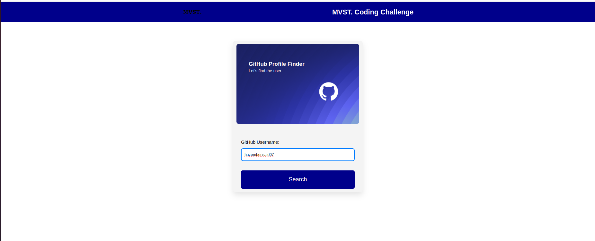
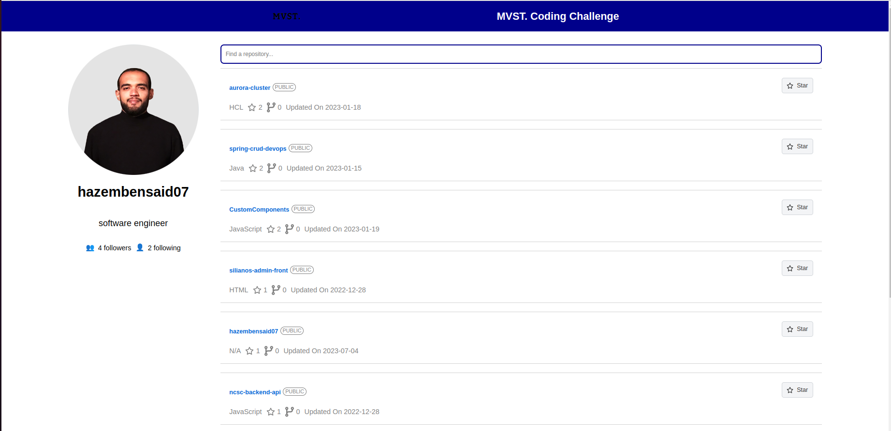

## MVST CODING CHALLENGE

This project was undertaken as part of a Coding challenge where the objective was to replicate GitHub's profile page. The development stack included ReactJS. The GitHub GraphQL API was utilized to enable the efficient delivery of desired data to the frontend using Apollo client.

Deployment Link <a href="https://mvst-coding-challengee.netlify.app/" target="_blank" rel="noopener noreferrer">here</a>.

## Features

- Using Github GraphQl API V4
- Using Cutom Hooks
- Search Github User by Username
- Get Full Details of User's Github Repositories
- Search In User's Github Repositories
- Loading and Error States
- Fully responsive

## Future Improvements

- Include the repository code check view.
- Include the option to interact with the repositories like star, unstar, clone directly in your pc, fork.
- Incorporate interaction with github user features like following and unfollowing.
- Include unit and integration tests.
- Give the repositories view pagination.
- Deploy to AWS <a href="https://medium.com/@hazembensaid195/deploy-a-react-application-on-aws-s3-aws-cloudfront-route53-aws-certificate-manager-using-bdafc8ff7e25" target="_blank" rel="noopener noreferrer">here</a>.

## Available Scripts

Don't forget to install dependencies first `npm install`
Please specify your personal access token to authenticate the GitHub GraphQL API by setting it in the environment variable. Assign your token as follows in .env: 
VITE_GITHUB_TOKEN=your_personal_access_token_here."
In the project directory, you can run:

### `npm run dev`

Runs the app in the development mode.\
Open [http://localhost:5173](http://localhost:5173) to view it in your browser.

### `npm run storybook`

It will start Storybook locally and output the address.\
Depending on your system configuration, it will automatically \
open the address in a new browser tab.

### `npm run build`

Builds the app for production to the `dist` folder.\
It correctly bundles React in production mode and optimizes the build for the best performance.

.
